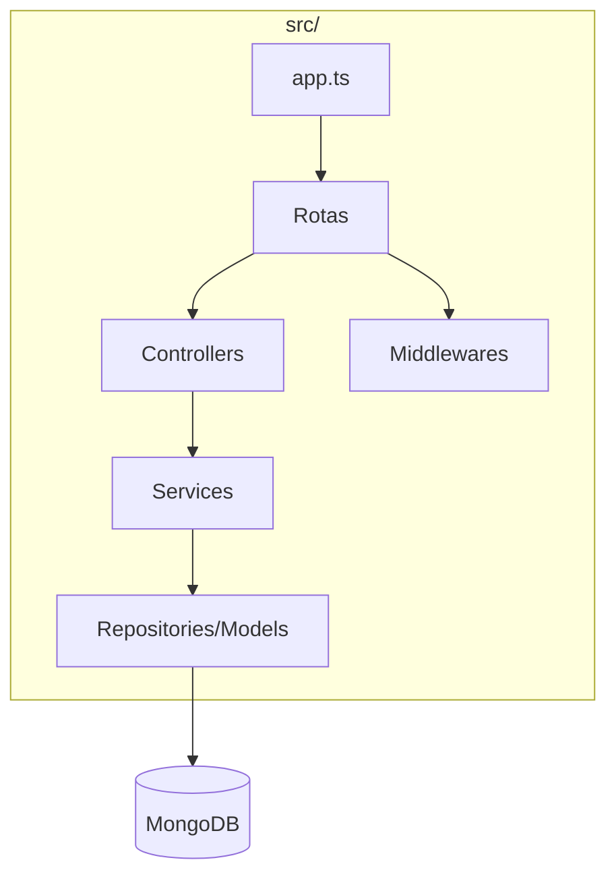
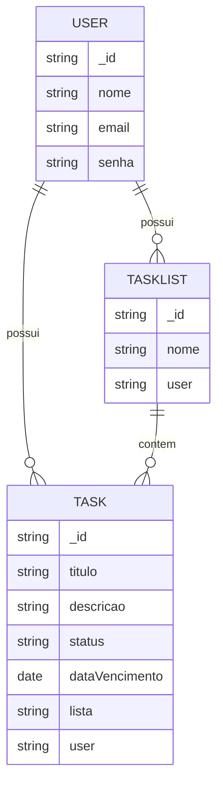
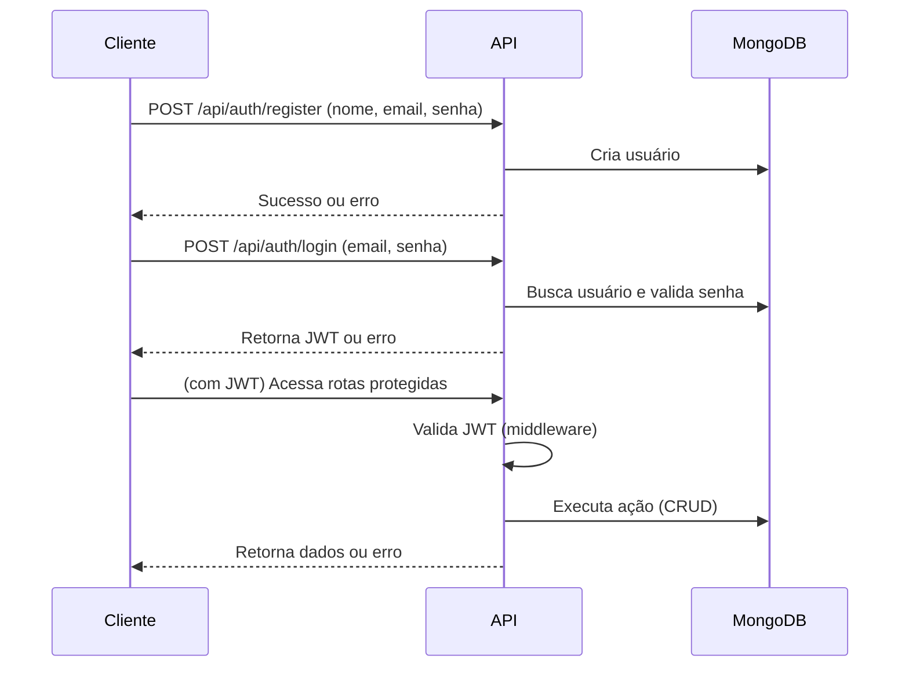

# BextTeste - Gerenciador de Tarefas

## Objetivo
Aplicação de gerenciamento de tarefas (Task Management) com Express.js, TypeScript e MongoDB. Permite criar, listar, atualizar e remover tarefas e listas, com autenticação JWT.

---

## Como rodar o projeto

1. Clone o repositório e acesse a pasta.
2. Instale as dependências:
   ```
   npm install
   ```
3. Configure o arquivo `.env` com:
   ```
   MONGO_URI=mongodb://localhost:27017/bext_teste
   PORT=3000
   JWT_SECRET=sua_chave_secreta
   NODE_ENV=development
   ```
4. Inicie o MongoDB (local ou via Docker):
   ```
   docker run -d -p 27017:27017 --name mongo_bext mongo
   ```
5. Rode o projeto em modo dev:
   ```
   npm run dev
   ```
6. Para rodar os testes:
   ```
   npm test
   ```

---

## Documentação das Rotas

### Autenticação
- `POST /api/auth/register`  
  Body: `{ "nome": "Seu Nome", "email": "email@exemplo.com", "senha": "123456" }`
- `POST /api/auth/login`  
  Body: `{ "email": "email@exemplo.com", "senha": "123456" }`

### Listas de Tarefas
- `POST /api/lists`  
  Body: `{ "nome": "Minha Lista" }`  
  (Requer JWT)
- `GET /api/lists`  
  (Requer JWT)
- `PUT /api/lists/:id`  
  Body: `{ "nome": "Novo Nome" }`  
  (Requer JWT)
- `DELETE /api/lists/:id`  
  (Requer JWT)

### Tarefas
- `POST /api/tasks`  
  Body: `{ "titulo": "Minha tarefa", "descricao": "Desc", "status": "pendente", "dataVencimento": "2025-07-10", "lista": "ID_DA_LISTA" }`  
  (Requer JWT)
- `GET /api/tasks?lista=&status=&dataVencimento=`  
  (Requer JWT)
- `PUT /api/tasks/:id`  
  Body: `{ ... }`  
  (Requer JWT)
- `DELETE /api/tasks/:id`  
  (Requer JWT)

---

## Diagramas

### Diagrama de Arquitetura


### Diagrama ER


### Fluxo de Autenticação


---

## Feedback

> O desenvolvimento deste desafio foi uma ótima oportunidade para praticar arquitetura limpa, autenticação JWT e testes automatizados com Jest/Supertest. A integração entre camadas ficou clara e o uso do MongoDB via Docker facilitou o setup. O desafio é bem completo e realista para o dia a dia de backend.
